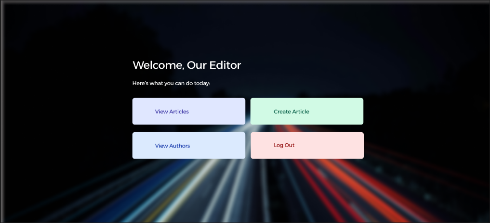
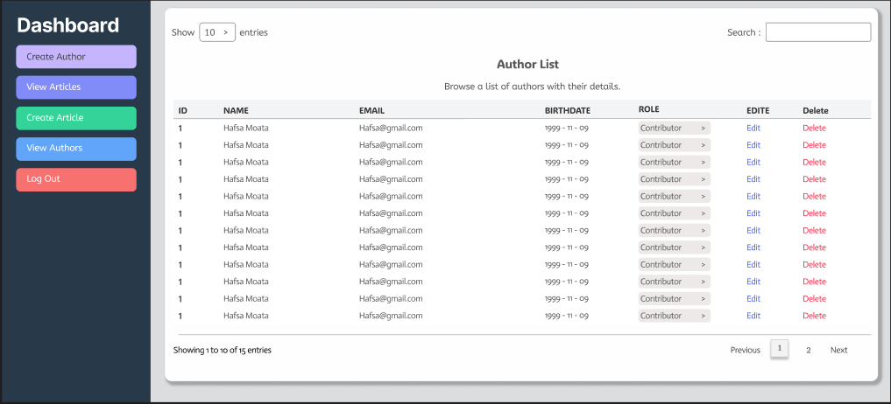
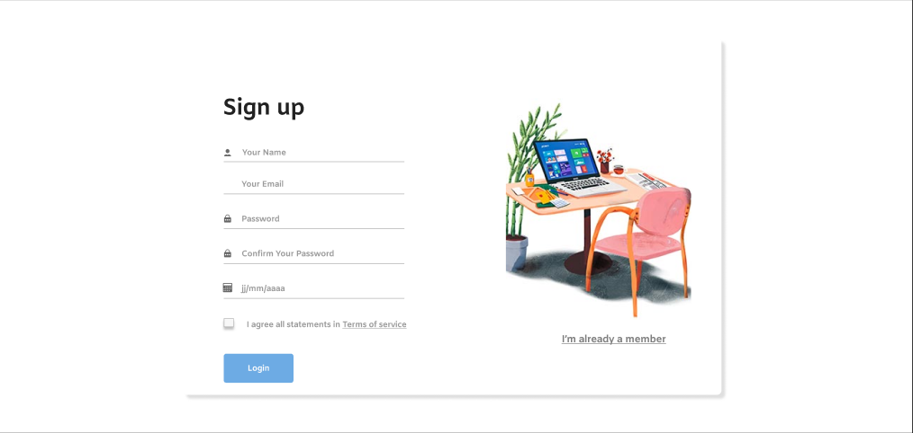
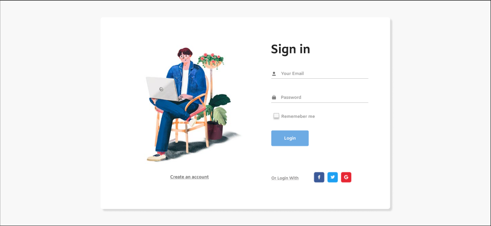
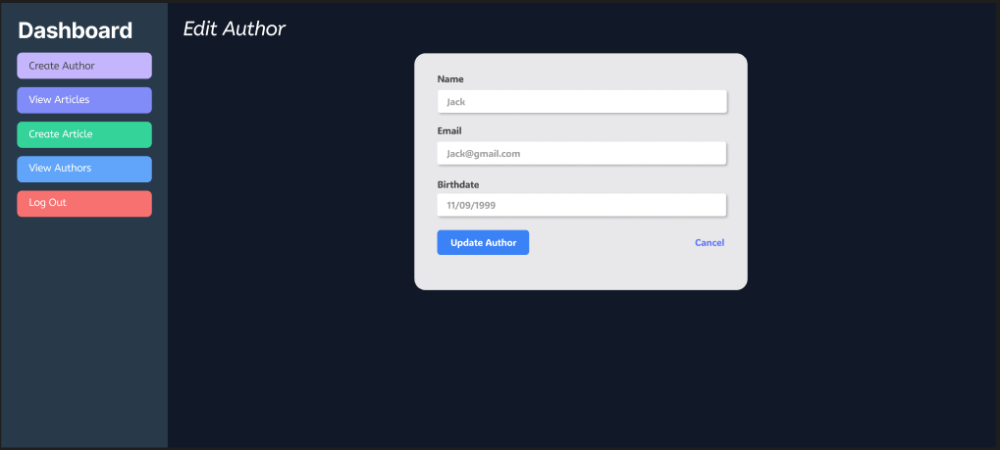

# Application Web de Gestion de Blog

## 📜 Contexte du Projet

Cette application web est une extension interactive et participative d'une solution de gestion de Blog console. Elle permet la gestion d'articles de blog, de commentaires, et d'auteurs, avec une interface utilisateur intuitive et des fonctionnalités robustes basées sur les concepts avancés de Java. Le projet est structuré autour de l'architecture MVC et utilise des technologies Java essentielles telles que les **Servlets**, **JSP**, **JSTL**, et **Hibernate** pour la persistance des données.

## 🎯 Objectifs

1. Créer une application web Java basée sur l'architecture MVC, utilisant Servlets, JSP et JSTL.
2. Implémenter les opérations CRUD (Create, Read, Update, Delete) pour les **articles**, **commentaires**, et **utilisateurs**.
3. Adapter la base de données existante pour l'intégration web.
4. Développer une interface utilisateur responsive et intuitive.
5. Appliquer les principes de gestion de projet Agile (Scrum) tout au long du développement.
6. Utiliser **Hibernate** pour la persistance des données.
7. Exploiter des concepts Java avancés et les bonnes pratiques de développement.

## Fonctionnalités Principales

### Page de Gestion des Articles
- Affichage de la liste des articles avec pagination.
- Création, modification et suppression d'articles.
- Recherche d'articles par titre.
- Affichage du nombre de commentaires associés à chaque article.

### Page de Gestion des Commentaires
- Affichage des commentaires d'un article avec pagination.
- Ajout, modification, et suppression de commentaires.
- Assigner un statut (approuvé/rejeté) à chaque commentaire.

### Page de Gestion des Auteurs
- Liste des auteurs avec pagination.
- Création, modification, et suppression d'auteurs.
- Assigner un rôle (Contributeur, Éditeur) à chaque auteur.

## Structure des Classes Principales

- **Article** : `titre`, `contenu`, `dateCreation`, `datePublication`, `statut` (*Enum*: brouillon, publié), `auteur`.
- **Commentaire** : `contenu`, `dateCreation`, `article`, `statut` (*Enum*: approuvé, rejeté).
- **Auteur** : `nom`, `email`, `password`, `dateNaissance`, `role` (*Enum*: Contributeur, Éditeur).

## Technologies Utilisées

- **Java 8**
- **Servlets**, **JSP**, **JSTL**
- **Maven** pour la gestion des dépendances
- **Tomcat** comme serveur d'applications
- **JUnit** et **Mockito** pour les tests unitaires (TDD)
- **Hibernate** pour la persistance des données
- **MySQL** comme base de données relationnelle
- **JIRA** pour la gestion de projet (Scrum) et intégration avec Git
- **Git** pour la gestion des versions (git-flow)
- **CSS Framework** pour le design responsive
- **Figma** pour le maquettage de l'interface

## ⚙️ Exigences Techniques


- Utilisation de l'architecture MVC découpée en plusieurs couches : **Présentation**, **Contrôleur**, **Service**, **DAO**, **Repository**, **Utilitaires**.
- **Servlets et JSP** sans annotations (via `web.xml`).
- **Design Patterns** : **Repository** et **Singleton**.
- Déploiement d'un fichier **WAR** avec Tomcat sans Eclipse.
- Utilisation de **LOGGER** pour le système de log.
- Validation avec les annotations Hibernate Validator comme `@NotNull`, `@Size`, etc.
- Pagination des résultats pour les articles, commentaires, et auteurs.
- Indexation, permissions **GRANT**, **UNIQUE**, et **NOT NULL** dans le script SQL.
- Persistance des données avec **JPA** et **Hibernate**.
- Développement itératif basé sur les principes **Scrum**.

## 📚 Concepts Java Avancés

- **Java Time API** et **Collection API**.
- Utilisation de **HashMaps**, **Lambda Expressions**, et **Java Stream API**.
- Gestion des valeurs nulles avec **Optional**.
- **Java Streams** pour un traitement fluide des collections.

## 📦 Structure du Projet

Le projet est organisé de manière modulaire et suit une architecture en couches :

1. **Présentation** : Vue dynamique à l'aide de JSP et JSTL.
2. **Contrôleur** : Gère la navigation et les requêtes utilisateur (Servlets).
3. **Service** : Contient la logique métier.
4. **Model** : Représente les entités de données et la logique de domaine.
5. **Repository** : Gestion des opérations CRUD.
6. **Utilitaires** : Fonctions diverses comme les **Logger**, les **Utilitaires de Date**, etc.

## 📊 Diagrammes UML

### Diagramme de Classes


Ce diagramme illustre la structure des classes principales de notre application, montrant les relations entre Article, Commentaire, et Auteur.

### Diagramme de Séquence


Ce diagramme montre la séquence d'interactions entre les différentes couches de l'application lors de l'ajout d'un nouvel article.

## 🎨 Maquettes Figma

### Page d'Accueil


Cette maquette présente la conception de notre page d'accueil, mettant en évidence les derniers articles et les fonctionnalités principales.

### Interface de Gestion des Auteurs


Cette maquette montre l'interface utilisateur pour la création et la modification d'Auteurs.

### Page d'Inscription (Signup)


Cette maquette illustre l'interface d'inscription pour les nouveaux utilisateurs, permettant la création de comptes auteur.

### Page de Connexion (Signin)


Cette maquette présente l'interface de connexion pour les utilisateurs existants, leur permettant d'accéder à leurs comptes.

### Page de Modification du Profil Auteur


Cette maquette montre l'interface permettant aux auteurs de modifier leurs informations de profil et leurs préférences.
## 📅 Gestion de Projet avec JIRA

### Tableau Kanban


Notre tableau Kanban dans JIRA, illustrant la progression des tâches à travers les différentes étapes du développement.

## Guide d'Installation

1. Clonez ce dépôt Git :
    ```bash
    git clone https://github.com/Hafsa-Naoufal-Abdelhamid/Hafsa_Naoufal_Wail_Sprint_2_B2_Blog.git
    ```

2. Importez le projet dans votre IDE Java préféré.

3. Configurez la base de données MySQL :
   - Créez une base de données nommée `taskmanager`.
   - Exécutez le script SQL fourni dans le dossier `/sql` pour initialiser les tables.

4. Compilez et construisez le projet avec Maven :
    ```bash
    mvn clean install
    ```

5. Déployez le fichier WAR sur Tomcat :
    ```bash
    mvn tomcat7:deploy
    ```

6. Accédez à l'application via `http://localhost:8080`.

## Développement Agile

Le projet a été géré en utilisant la méthodologie **Scrum**. Des sprints ont été planifiés sur **JIRA** avec des tâches attribuées aux différentes parties du projet. Chaque fonctionnalité a été déployée de manière incrémentale avec des intégrations continues sur Git.

## Tests Unitaires

Les tests ont été créés en utilisant **JUnit** et **Mockito** pour s'assurer que chaque composant fonctionne correctement. Le développement a été guidé par les tests (*Test-Driven Development*).

## Auteurs

Cette application a été développée par **Wael Boukhari**, **Hafsa Elmoatassim Billah**, et **Naoufal Labrihmi**.

---

**Merci d'utiliser l'application de gestion de contenu !**